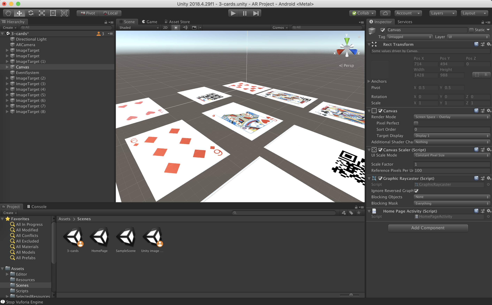
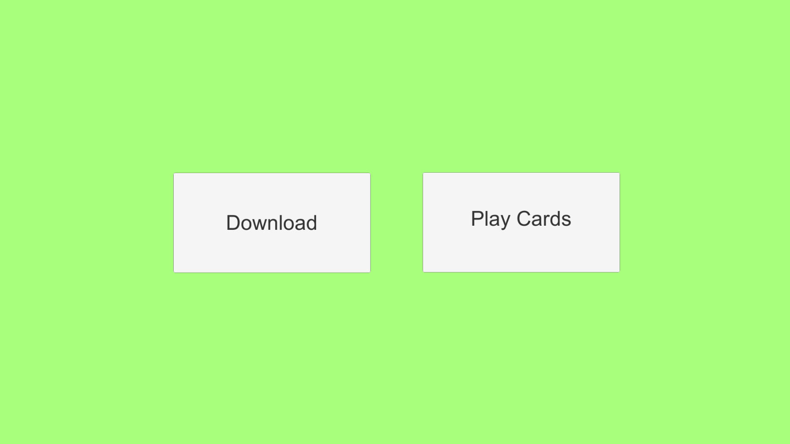

# MagicCards
HackNots-2020 submission and overall winner! 🏆

[Devpost Page] (https://devpost.com/software/magic-cards)

Support for iOS and Android.

## Judges!
- please go to DEMO and launch MagicCards_MacOS.app for macOs. Due to time constraints we were not able to create one for windows.

## AR
https://developer.vuforia.com/

## Flutter
setup:
https://flutter.dev/docs/get-started/install/macos

get vscode :
https://code.visualstudio.com/download

get flutter plug in's

run ios
launch ios emulator
flutter run
 select ios device

run android
launch android emulator
flutter run
 select android device

## API

## Firebase

## Database

Note: Due to the limitations of flutter and react native for AR we decided to pivot on suday and code everything on unity.

